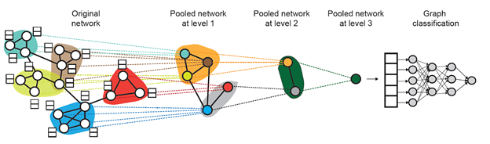
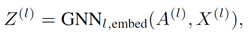
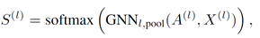
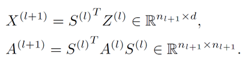

# Basic Information
Hierarchical Graph Representation Learning with Differentiable Pooling (Rex Ying et al., NeurIPS 2018): https://arxiv.org/pdf/1806.08804.pdf
## Git Repo
https://github.com/RexYing/diffpool
## Reference
If you make advantage of the GAT model in your research, please cite the following in your manuscript:
```
@article{ying2018hierarchical,
  title={Hierarchical graph representation learning with differentiable pooling},
  author={Ying, Rex and You, Jiaxuan and Morris, Christopher and Ren, Xiang and Hamilton, William L and Leskovec, Jure},
  journal={arXiv preprint arXiv:1806.08804},
  year={2018}
}
```

# Reading Notes
## Idea
A major limitation of current GNN architectures is that they are inherently flat as they only propagate information across the edges of the graph and are unable to infer and aggregate the
information in a hierarchical way. 

DIFFPOOL allows for developing deeper GNN models that can learn to operate on hierarchical representations of a graph.

## Results
They show that DIFFPOOL can be combined with various GNN approaches, resulting in an average 7% gain in accuracy and a new state of the art on four out of five benchmark graph classification tasks.

## Model Structure


Graph Convolutional Networks (GCNs) are used as the basic layers for Diffpool.  
They use an assignment matrix in their model.

  


Aggregate information for different clusters, and compute the connection matrix for the new clusters.  


